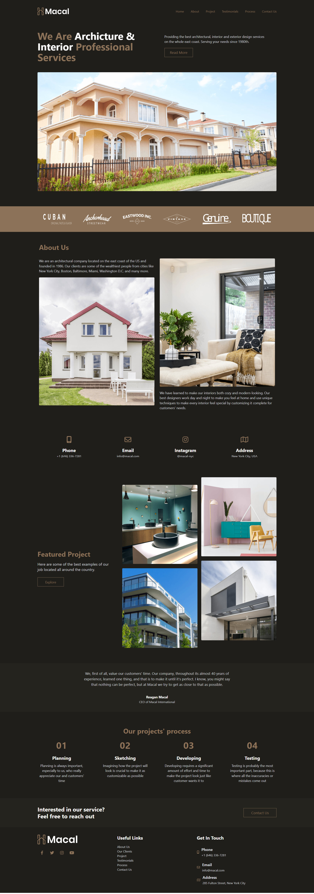

  

<h3 align="center">Macal</h3>

---

 Macal Website Landing Page
     

## 📝 Table of Contents

- [About](#about)
- [Deployment](#deployment)
- [Built Using](#built_using)
- [Authors](#authors)
- [Acknowledgments](#acknowledgement)

## 🧐 About 

Elegant TailwindCSS landing page for a fictional architectural company called Macal. This is by far my favorite project, I implemented lots of animations in it, which I really like. You can [see it for yourself](https://seesmof.github.io/macal/) and test everything. All is active, all buttons are clickable, as well as all the links.

## 🚀 Deployment 

- [Live View](https://seesmof.github.io/macal/)

## ⛏️ Built Using 

- [HTML](https://www.w3.org/html/) - Markup Language
- [CSS](https://www.w3schools.com/css/) - Styling Language
- [SASS](https://sass-lang.com/) - CSS Pre-Processor
- [TailwindCSS](https://tailwindcss.com/) - CSS Framework

## ✍️ Authors 

- [@seesmof](https://github.com/seesmof) - Development
- [EnvatoElements](https://elements.envato.com/) - Idea & Desing

## 🎉 Acknowledgements 

- [EnvatoElements](https://elements.envato.com/) for great website templates
